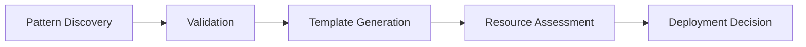
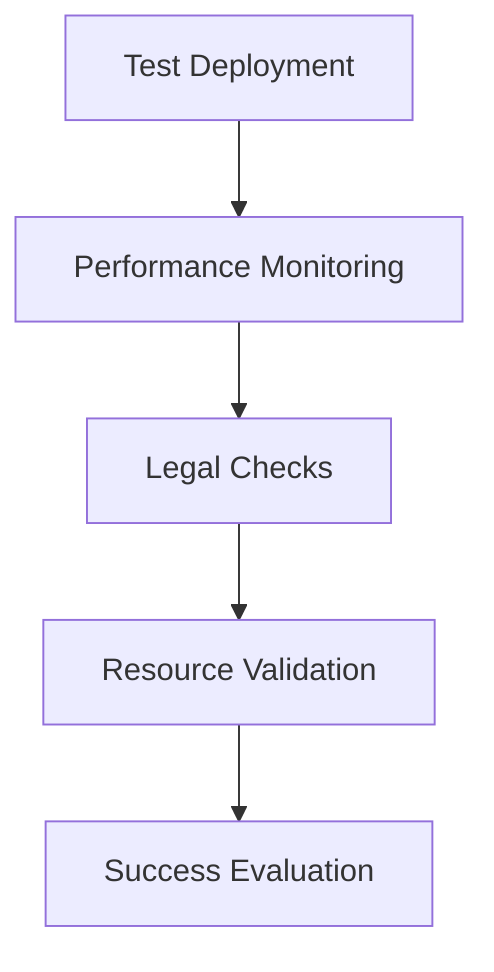

# System Architecture

## Overview

The Agent Swarm System is built on a distributed architecture with multiple specialized components working together. The system uses asynchronous processing and event-driven patterns to maintain scalability and responsiveness.

## Core Components

### 1. Meta-Learning Core (`src/core/meta_learning.py`)

The Meta-Learning Core is the central intelligence of the system, responsible for:

- Pattern recognition and validation
- Knowledge graph maintenance
- Strategy evolution
- Resource allocation

```python
class MetaLearningCore:
    def __init__(self):
        self.pattern_engine = PatternDiscoveryEngine()
        self.knowledge_graph = {}
        self.active_swarms = {}
```

Key Features:
- Asynchronous pattern discovery
- Real-time strategy adaptation
- Automated resource management
- Performance optimization

### 2. Pattern Discovery Engine (`src/core/pattern_discovery.py`)

Responsible for identifying and validating profitable patterns:

- Data source integration
- Pattern validation
- Success metric analysis
- Risk assessment

```python
class PatternDiscoveryEngine:
    def __init__(self):
        self.patterns = {}
        self.validation_metrics = {
            'min_profit': 100.0,
            'min_roi': 0.3,
            'max_startup': 1000.0,
            'min_automation': 0.7
        }
```

### 3. Swarm Controller (`src/core/swarm_controller.py`)

Manages the coordination between different agents:

- Agent lifecycle management
- Resource allocation
- Performance monitoring
- Scaling decisions

```python
class SwarmController:
    def __init__(self):
        self.meta_learning = MetaLearningCore()
        self.discovery_agent = MethodDiscoveryAgent()
        self.legal_agent = LegalAssessmentAgent()
        self.resource_agent = ResourceMappingAgent()
        self.profit_agent = ProfitAnalysisAgent()
```

## Specialized Agents

### 1. Method Discovery Agent (`src/agents/discovery_agent.py`)

Focuses on finding and validating new methods:

- Pattern identification
- Success validation
- Market analysis
- Competition assessment

### 2. Legal Assessment Agent (`src/agents/legal_agent.py`)

Handles compliance and legal requirements:

- Regulatory compliance checking
- Legal documentation
- Terms of Service monitoring
- Data protection

### 3. Resource Mapping Agent (`src/agents/resource_agent.py`)

Manages system resources:

- Resource identification
- Cost optimization
- Scaling management
- Infrastructure planning

### 4. Profit Analysis Agent (`src/agents/profit_agent.py`)

Analyzes financial aspects:

- Profit calculation
- Cost estimation
- ROI projection
- Financial monitoring

## System Workflow

### 1. Discovery Phase



### 2. Validation Phase



### 3. Scaling Phase


## Data Flow

### 1. Pattern Discovery
- Source data ingestion
- Pattern identification
- Initial validation
- Template generation

### 2. Validation Process
- Test deployment
- Metric collection
- Performance analysis
- Success determination

### 3. Production Deployment
- Resource allocation
- Infrastructure setup
- Monitoring configuration
- Scaling management

## Security Architecture

### 1. Access Control
- Role-based permissions
- Resource isolation
- API authentication
- Audit logging

### 2. Data Protection
- Encryption at rest
- Secure communication
- Privacy compliance
- Data retention policies

### 3. Monitoring
- Real-time alerts
- Performance metrics
- Security events
- Compliance monitoring

## Scaling Strategy

### 1. Vertical Scaling
- Resource optimization
- Performance tuning
- Capacity planning
- Load balancing

### 2. Horizontal Scaling
- Instance replication
- Load distribution
- Geographic distribution
- Failover management

## Error Handling

### 1. Fault Tolerance
- Graceful degradation
- Automatic recovery
- Error logging
- Alert generation

### 2. Recovery Procedures
- State restoration
- Resource cleanup
- Error correction
- System stabilization

## Performance Optimization

### 1. Resource Management
- Memory optimization
- CPU utilization
- Network efficiency
- Storage optimization

### 2. Caching Strategy
- Result caching
- Pattern caching
- Resource caching
- Configuration caching

## Development Guidelines

### 1. Code Structure
- Modular design
- Clean architecture
- SOLID principles
- DRY principles

### 2. Testing Strategy
- Unit testing
- Integration testing
- Performance testing
- Security testing

## Deployment Architecture

### 1. Infrastructure
- Serverless compute
- Key-value storage
- CDN integration
- Monitoring systems

### 2. Scaling
- Auto-scaling rules
- Load balancing
- Geographic distribution
- Resource management

## Future Considerations

### 1. Extensibility
- Plugin architecture
- API expansion
- New agent types
- Additional platforms

### 2. Optimization
- AI/ML integration
- Advanced analytics
- Predictive scaling
- Enhanced automation
